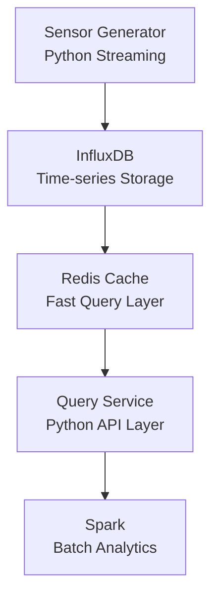

# Time-Series Analytics with Caching Layer

This is a project by:

- **Jane Kedina Imoke**
- **Ricardo Ramos Morales**

## Project Overview

This project implements a Big Data time-series analytics pipeline using a combination of the following technologies:

- InfluxDB: Time-series database for sensor data storage.
- Redis: Caching layer for fast query responses.
- Apache Spark (PySpark): Batch analytics engine.
- Python: Core data processing and integration.
- Streamlit: Real-time interactive dashboard.

This system was built to simulate real-world IoT sensor data processing with:
- Real-time data ingestion.
- Query optimisation via caching.
- Historical batch analytics.
- Anomaly detection.

## Objectives

- Build a scalable time-series data pipeline (Lambda architecture).
- Demonstrate caching performance improvements.
- Perform batch analytics on historical data using Spark.
- Detect anomalies in sensor behaviour.
- Evaluate system performance via cache vs non-cache queries.

## Big Data Architecture Pattern

This project follows a simplified Lambda Architecture:

### Speed Layer
- Redis Cache
- Provides low-latency access to recent sensor data

### Serving Layer
- Query Service
- Streamlit Dashboard

### Batch Layer
- Spark
- Historical analytics and anomaly detection

### Storage Layer
- InfluxDB
- Long-term time-series storage

## System Architecture



## Project Structure

```text
time-series-analytics-with-caching-layer/
├── data_generator/
│   └── sensor_generator.py
├── storage/
│   ├── influx_writer.py
│   └── query_service.py   
├── analytics/
│   ├── spark_analysis.py
│   └── export_data.py
├── dashboard/
│   └── app.py
├── tests/
│   ├── redis_test.py
│   ├── benchmark.py
│   └── debug_query.py
├── docker/
│   └── docker-compose.yml
├── cache/
|   └── redis_cache.py
├── requirements.txt
└── README.md
```

## Technologies Used:

### Database(s)
- InfluxDB (Time-series Database)
- Redis (In-memory cache)

### Processing
- Apache Spark (PySpark)

### Programming
- Python 3.11.5

### Libraries
- `influxdb-client`
- `redis`
- `pyspark`
- `pandas`
- `streamlit`
- `plotly`
- `streamlit-autorefresh`

## Features

### 1. Sensor Data Simulation
- Generates synthetic IoT sensor data.
- Includes:
    - temperature,
    - humidity,
    - CPU usage,
    - energy consumption
- Inject random anomalies.

### 2. Time-Series Storage (InfluxDB)
- Stores sensor data in real-time.
- Uses structured measurement and tags.
- Supports efficient time-based queries.

### 3. Redis Caching Layer
- Caches frequent entries
- Reduces database load.
- Improves response time significantly.

### 4. Spark Batch Analysis
Performs historical analysis of:
- Average sensor values per device.
- CPU usage filtering.
- Sensor performance summaries.
- **Hybrid** anomaly detection.

### 5. Anomaly detection

A sensor is flagged as anomalous if:

#### Rule-Based:
- CPU usage threshold (>55%)
- Temperature threshold (> 27°C or < 20°C)

#### Statistical:
- Z-score based detection
- Uses mean & standard deviation

### 6. Streamlit Dashboard
Features:
- Real-time sensor monitoring
- Auto-refresh every 5 seconds
- KPI overview
    - Number of sensors
    - Average temperature
    - Average CPU usage
    - Detected anomalies
    - Cache performance gain
- Sensor health indicators
- Interactive Plotly visualisations
- Temperature analysis
- CPU usage analysis
- Energy consumption analysis
- Anomaly detection panel
- System architecture visualisation

## Performance Measure (Caching Layer)

The caching system significantly improves performance:

| Metric | Value |
|----------|----------|
| Cold Query Latency (Cache Miss) | 0.052993 s |
| Warm Query Latency (Cache Hit) | 0.001840 s |
| Performance Improvement | 96.53% |

The Redis caching layer reduced query latency from approximately 53 ms to under 2 ms, demonstrating the effectiveness of caching for frequently requested sensor data.

## Results

The system successfully demonstrates:

- Real-time sensor data ingestion
- Time-series storage using InfluxDB
- Redis-based query acceleration
- Historical analytics using Spark
- Rule-based and statistical anomaly detection
- Interactive visualisation using Streamlit

### Key Findings

- Redis reduced query latency by over 96%
- Spark successfully processed historical sensor records
- Anomaly detection identified abnormal CPU and temperature spikes
- The architecture supports separation of hot data (cache) and cold data (historical storage)

## Spark Analytics Output

Spark is used to compute:

- Average temperature per sensor
- CPU usage trends
- Energy consumption analysis
- Sensor performance summary

## How to Run the Project

### NB: Install Dependencies
```
pip install -r requirements.txt
```

### 1. Start InfluxDB and Redis (Docker services)
```
docker compose up -d
```

Do ensure that:
- InfluxDB runs on ```http://localhost:8086```
- Redis runs on ```localhost:6379```

### 2. Run Sensor Generator (Python)
```
python -m data_generator.sensor_generator
```

### 3. Write the Data to InfluxDB
```
python -m storage.influx_writer
```

### 4. Export Data for Spark
```
python -m analytics/export_data
```

### 5. Run Spark
```
python -m analytics.spark_analysis
```

### 6. Launch Dashboard
```
streamlit run dashboard/app.py
```

### Dashboard Preview (What it shows)
- Live sensor KPIs
- Real-time updates (5s refresh)
- Sensor health status
- CPU / Temperature / Energy charts
- Anomaly detection panel
- System architecture diagram

This project simulates a production-grade IoT analytics pipeline combining:

- Streaming data generation
- Time-series storage
- Caching optimisation
- Batch analytics
- Real-time visualisation

It demonstrates how modern Big Data architectures integrate multiple technologies into a unified system.

## Future Improvements

Possible future extensions include:

- Historical trend visualisation directly from InfluxDB
- Real-time streaming analytics using Spark Structured Streaming
- Docker Compose orchestration for the entire application stack
- Machine learning-based anomaly detection
- Grafana integration for enterprise monitoring
- Cloud deployment on AWS, Azure, or GCP

### THIS PROJECT IS FOR ACADEMIC PURPOSES